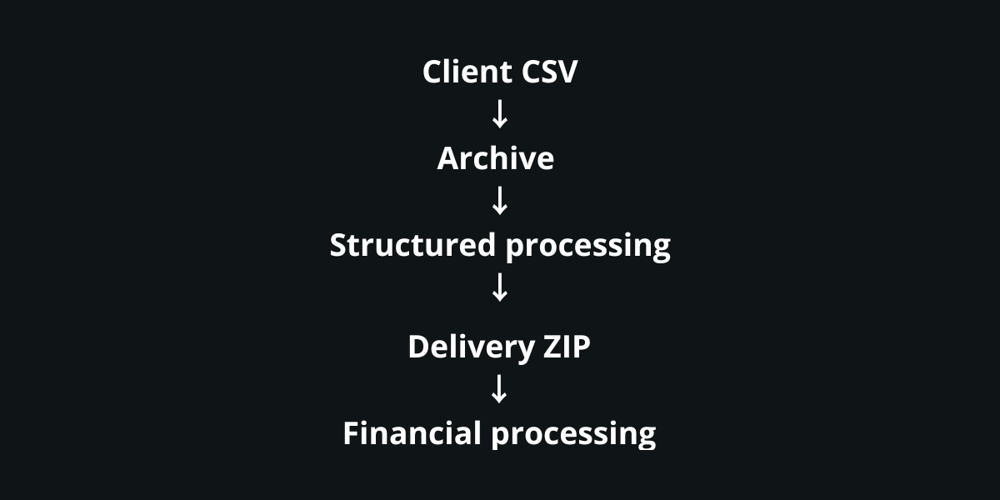

<p align="center">
  
</p>

> 🇬🇧 English | [🇫🇷 Français](./README_FR.md)


[-0095b1?style=flat)](https://palks-studio.com/en/batch-invoicing-facturx)

<p align="center">
  <a href="https://palks-studio.com">
    
  </a>
</p>


# Palks Studio — Automation System
**Financial automation built for rigor, traceability, and longevity**

> This repository is a technical presentation and documentation repository.  
> It does not contain downloadable source code or production files.

This README documents design principles and system architecture.  
It intentionally avoids operational procedures and sensitive details.

[-0095b1?style=flat)](https://palks-studio.com/en/batch-invoicing-facturx)

---

## Overview

This repository presents a financial automation system designed to handle:  

- invoice generation (single & batch)  
- revenue tracking  
- payment reconciliation  
- client balances  
- accounting-ready exports

The system is deterministic, auditable, and explicit by design.

It operates:  

- without a database  
- without a CMS  
- without a SaaS dependency  
- without any exposed web interface

All executions run server-side, via CLI scripts and cron, with a strict separation of responsibilities.

This project is not a product, not a SaaS, and not a plug-and-play tool.  
It documents a production-grade approach to financial automation.

Over time, the engine has been progressively extended  
to cover real-world business cases,  
without compromising its original design principles.

The billing system now supports:  

- multi-line invoices  
- multiple VAT rates per invoice  
- complex or extended service periods  
- multi-month billing scenarios  
- complex combinations while remaining EN16931 Comfort compliant

This functional expansion did not alter  
the deterministic, auditable, and traceable nature of the system.

### Electronic invoicing (Factur-X)

The system natively supports the generation of Factur-X invoices (hybrid PDF with embedded XML),  
in compliance with the European standard EN 16931 (Comfort profile):  

- generation of EN 16931-compliant Factur-X XML  
- XML validation (XSD and Schematron)  
- embedding of the XML into the PDF document  
- production of a single final document (Factur-X hybrid PDF)  
- direct integration within automation processes  
- no parallel formats  
- no persistent XML storage

The system is designed for business compliance and e-invoicing interoperability (France / EU).  
Generated invoices comply with the PDF/A-3 standard for long-term archiving.

Factur-X is treated as a native component of the system,  
not as an external or optional module.

---

## Project structure

```
automation-system/
│
├── engine/                           → Core automation engine (billing, generation, processing)
├── data/                             → Internal data storage (clients, invoices, tracking)
├── tools/                            → Internal utilities and maintenance scripts
├── exports/                          → Data export and reporting
├── downloads/                        → Generated document delivery
├── clients/                          → Client configuration
├── contracts/                        → Legal and contractual documents
│
├── LICENCE.md                        → Conditions d’utilisation et cadre légal (FR)
├── LICENSE.md                        → Terms of use and legal Framework
│
├── LICENCE.md                        → Conditions d’utilisation et cadre légal (FR)
├── LICENSE.md                        → Terms of use and legal Framework
│
└── docs/
    ├── README_FR.md                  → Documentation générale du système (FR)
    ├── README.md                     → General system documentation
    │
    ├── SERVICE_MEMO_FR.md            → Note interne de positionnement du service (FR)
    ├── SERVICE_MEMO.md               → Internal Service Positioning Memo
    │
    ├── README_DEPLOY_FR.md           → Guide d’installation et d’exploitation (FR)
    ├── README_DEPLOY_EN.md           → Installation and Production Guide
    │
    ├── VUE_DENSEMBLE_AUTOMATION.md   → Vue d’ensemble du système d’automatisation de facturation (FR)
    └── SYSTEM_OVERVIEW_AUTOMATION.md → Billing Automation System Overview
```


```
palks-studio.com/
├── library/
│   ├── onboarding-client-fr.html         → Génération contrat + configuration client (FR)
│   ├── onboarding-client-en.html         → Contract generation + client configuration (EN)
│   ├── service-agreement-fr.html         → Template de contrat (FR)
│   ├── service-agreement-en.html         → Contract template (EN)
│   ├── import-clients-fr.html            → Formulaire d’envoi CSV client (FR)
│   ├── import-clients-en.html            → Client CSV upload form (EN)
│   └── invoice-layout.html               → Template HTML de facture (FR) / Invoice HTML template (EN)
│
├── contract-builder.php                  → Backend génération PDF (FR) / PDF generation backend (EN)
├── process-import.php                    → Moteur de traitement du formulaire CSV (FR) / CSV upload form processing engine (EN)
│
├── secure_downloads/
│   └── access.php                        → Point d'accès aux téléchargements batch (FR) / Batch download access endpoint (EN)
│
└── temp_tokens/
    ├── activity.log                      → Journal des téléchargements réels (FR) / Download activity log (EN)
    └── secure_tokens.json                → Stockage des tokens de téléchargement (FR) / Download token storage (EN)
```


---

## What this repository is (and is not)

### This repository is

- a documented architecture for financial automation  
- a system designed to be predictable and auditable  
- an example of strict separation between billing, payments, and accounting  
- a real-world system used in production

### This repository is not

- a certified accounting software  
- a ready-to-use invoicing tool  
- a payment processing system  
- a web application or API service

The outputs produced by this system are intended for internal operational use and for integration with standard accounting workflows.

---

## Core design principles

This system follows a small set of non-negotiable principles:  

- **No magic**  
  Every operation is explicit and traceable.

- **No silent processing**  
  Errors stop execution. They are logged and surfaced.

- **No implicit correction**  
  Invalid inputs are rejected, not “fixed”.

- **Files are proofs**  
  Generated artifacts are considered immutable evidence, not disposable outputs.

- **Strict separation of responsibilities**  
  Billing, payments, balances, receipts, and exports are handled independently.

- **CLI-only execution**  
  No web exposure, no background ambiguity.

These principles favor predictability over convenience and clarity over speed.

The progressive extension of the engine  
did not compromise these principles.

Newly added capabilities  
(multi-line invoices, multiple VAT rates, complex service periods)  
strictly follow the same rules  
of predictability, traceability, and explicit rejection.

---

## System architecture (high-level)

The system is composed of independent layers, each with a single responsibility:  

- **Billing engines**  
  - direct invoicing  
  - batch invoicing (CSV-driven)

- **Business rules**  
  - centralized pricing and billing logic  
  - single source of truth

- **Alerting layer**  
  - blocking vs informational alerts  
  - explicit execution feedback

- **Payment layer**  
  - manual payment records  
  - deliberately decoupled from billing

- **Balance reconciliation**  
  - computed state (invoiced vs paid)  
  - paid / unpaid detection

- **Export layer**  
  - accounting-ready CSV outputs  
  - reproducible at any time

Some layers can evolve independently  
without impacting others,  
allowing the system to be extended  
without global side effects.

---

## Execution model

The system runs on a closed, repeatable cycle:  

1. **Generation phase**  
   Invoices are generated based on explicit rules and configurations.

2. **Payment phase**  
   Payments are recorded independently, without automation or assumptions.

### Invoice receipt stamping tool

A complementary operational tool allows the generation of  
stamped “paid” versions of invoices from the original PDF files.

This tool:  

- accepts a ZIP archive containing invoices  
- automatically detects PDF files  
- applies a clear "PAID" / receipt stamp with payment date  
- generates a new stamped version of the document  
- supports both single and batch processing

This tool does not interact with the invoicing engine itself  
and never modifies the original invoices.

Stamped documents are considered operational artefacts  
derived from the issued invoices.

3. **Reconciliation phase**  
   Invoiced amounts are compared against received payments.

4. **Consolidation phase**  
   Client balances are computed and statuses updated.

5. **Export phase**  
   Accounting-ready artifacts are produced on demand.

### Client onboarding tool

A dedicated component transforms data collected from the onboarding form  
into an internal client configuration used by the automation system.

During processing:  

- generation of a unique client identifier  
- creation of the client configuration  
- preparation of the associated batch configuration  
- initialization of payment tracking  
- archiving of processed onboarding data

This step occurs strictly during the setup phase  
and does not interfere with the monthly execution cycle.

The system never infers missing information.

---

## Batch invoicing model

In batch mode:  

- one client provides one CSV file  
- one CSV line equals one invoice  
- validation is strict and structural  
- the entire batch stops on the first error  
- raw inputs are archived before consumption

This model favors data integrity over partial success.

The billing model supports complex use cases  
without altering the execution cycle:  

- multi-line invoices  
- multiple VAT rates within a single invoice  
- extended or split service periods  
- multi-month billing scenarios

These capabilities are integrated  
without introducing implicit conditional logic  
or special-case processing outside the engine.

### Entry point — client CSV submission

The monthly CSV file is submitted by the client through a dedicated upload form,  
accessible only via an individual secure link provided after contract validation.

The entry point:  

- accepts CSV files only  
- provides a downloadable reference CSV template  
- stores the file within a structured internal storage system  
- enforces a single submission per client and per period  
- retains the file for strict downstream validation

The submitted CSV is treated as a **raw source of billing data**  
and is never considered a final invoice.

It is then validated and processed exclusively within the batch automation workflow.

---

## Integrity & safeguards

Several mechanisms are enforced across the system:  

- anti-duplicate protections  
- annual sequential counters  
- immutable archives  
- explicit execution flags  
- categorized alerts  
- exhaustive logging

A failed execution is considered safer than a partial one.

Validation rules remain identical  
regardless of invoice complexity.

A complex case is treated  
with the same requirements as a simple one.

---

## Single-client mode (targeted execution)

Some CLI scripts support an optional parameter:  

`--client=<client_id>`

This mode allows targeted execution for a single client,  
mainly for diagnostics or controlled recovery.

Filtering relies exclusively on the onboarding-generated
`client_id`.

This mechanism does not alter:  

- anti-duplicate protections  
- execution flags  
- core business logic

It is intended for occasional operational use  
and does not replace scheduled system execution.

---

## Security posture

- CLI-only execution  
- no exposed endpoints  
- no browser access  
- no external API dependency for core operations  
- data stored locally on the server

Security is achieved through absence of surface, not complexity.

---

## Maintenance & longevity

The system is designed to:  

- be understandable without its original author  
- be auditable months or years later  
- degrade loudly rather than silently  
- integrate cleanly with standard accounting processes

This repository documents an engineering approach, not a shortcut.

---

## Project status

Status: Stable — used in real production conditions.

The system has been designed to operate autonomously,  
with a strong emphasis on rigor, traceability, and long-term maintainability.

---

## Libraries

- mPDF 8.3 (mpdf/mpdf) — PDF/A-1b generation (invoices and paid receipts)  
- setasign/fpdi — PDF reading and overlay (stamping via invoice stamper)  
- factur-x 3.15 (Python) — Factur-X XML injection and PDF/A-3 conversion  
- pypdf — automatic dependency of factur-x

---

© Palks Studio — see LICENSE.md  
https://palks-studio.com
