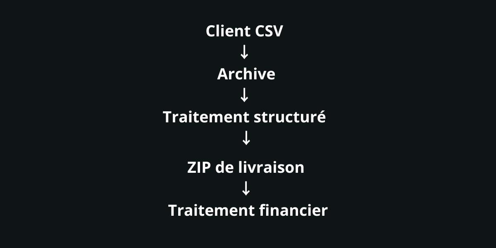

<p align="center">
  
</p>

> 🇫🇷 Français | [🇬🇧 English](./README.md)


<p align="center">
  <a href="https://palks-studio.com">
    
  </a>
</p>

# Palks Studio — Système d’automatisation  
**Automatisation financière conçue pour la rigueur, la traçabilité et la durée**

> Ce dépôt constitue une présentation technique et une documentation du projet.  
> Il ne contient pas de code source téléchargeable ni de fichiers de production.

Ce README documente les principes de conception et l’architecture du système.  
Il évite volontairement toute procédure opérationnelle ou détail sensible.

---

## Vue d’ensemble

Ce dépôt présente un système d’automatisation financière conçu pour gérer :  

- la génération de factures (directe et batch)  
- le suivi des recettes  
- la réconciliation des paiements  
- les soldes clients  
- les exports comptables exploitables

Le système est déterministe, auditable et explicite par conception.

Il fonctionne :  

- sans base de données  
- sans CMS  
- sans dépendance SaaS  
- sans interface web exposée

Toutes les exécutions se font côté serveur, via scripts CLI et cron, avec une séparation stricte des responsabilités.

Ce projet n’est pas un produit, pas un SaaS, pas un outil clé en main.  
Il documente une approche de production sérieuse de l’automatisation financière.

Depuis ses premières versions, le moteur a été progressivement enrichi  
pour couvrir des cas métier réels et complexes, sans remettre en cause  
les principes de départ.

La facturation prend désormais en charge :  

- des factures multi-lignes  
- des factures à multi-taux de TVA  
- des périodes de service étendues ou fractionnées  
- des facturations couvrant plusieurs mois  
- des combinaisons complexes tout en restant conformes EN16931 Comfort

L’enrichissement fonctionnel n’a pas modifié  
la nature déterministe, auditable et traçable du système.

---

## Structure du projet

```
automation-system/
│
├── engine/                           → Moteur d’automatisation (facturation, génération, traitement)
├── data/                             → Stockage interne des données (clients, factures, suivi)
├── tools/                            → Outils internes et scripts de maintenance
├── exports/                          → Export de données et reporting
├── downloads/                        → Distribution des documents générés
├── clients/                          → Configuration des clients
├── contracts/                        → Documents juridiques et contractuels
│
├── LICENCE.md                        → Conditions d’utilisation et cadre légal (FR)
├── LICENSE.md                        → Terms of use and legal framework (EN)
│
└── docs/
    ├── README_FR.md                  → Documentation générale du système
    ├── README.md                     → General system documentation (EN)
    │
    ├── SERVICE_MEMO_FR.md            → Note interne de positionnement du service
    ├── SERVICE_MEMO.md               → Internal Service Positioning Memo (EN)
    │
    ├── README_DEPLOY_FR.md           → Guide d’installation et d’exploitation
    ├── README_DEPLOY_EN.md           → Installation and Production Guide (EN)
    │
    ├── VUE_DENSEMBLE_AUTOMATION.md   → Vue d’ensemble du système d’automatisation de facturation
    └── SYSTEM_OVERVIEW_AUTOMATION.md → Billing Automation System Overview (EN)
```


```
palks-studio.com/
├── library/
│   ├── onboarding-client-fr.html         → Génération contrat + configuration client (FR)
│   ├── onboarding-client-en.html         → Contract generation + client configuration (EN)
│   ├── service-agreement-fr.html         → Template de contrat (FR)
│   ├── service-agreement-en.html         → Contract template (EN)
│   ├── import-clients-fr.html            → Formulaire d’envoi CSV client (FR)
│   ├── import-clients-en.html            → Client CSV upload form (EN)
│   └── invoice-layout.html               → Template HTML de facture (FR) / Invoice HTML template (EN)
│
├── contract-builder.php                  → Backend génération PDF (FR) / PDF generation backend (EN)
├── process-import.php                    → Moteur de traitement du formulaire CSV (FR) / CSV upload form processing engine (EN)
│
├── secure_downloads/
│   └── access.php                        → Point d'accès aux téléchargements batch (FR) / Batch download access endpoint (EN)
│
└── temp_tokens/
    ├── activity.log                      → Journal des téléchargements réels (FR) / Download activity log (EN)
    └── secure_tokens.json                → Stockage des tokens de téléchargement (FR) / Download token storage (EN)
```


---

## Ce que ce dépôt est (et n’est pas)

### Ce dépôt est

- une architecture documentée d’automatisation financière  
- un système pensé pour être prévisible et auditable  
- un exemple de séparation stricte entre facturation, paiements et comptabilité  
- un système réel utilisé en conditions de production

### Ce dépôt n’est pas

- un logiciel de comptabilité certifié  
- un outil de facturation prêt à l’emploi  
- un système de paiement automatisé  
- une application web ou une API

Les données produites sont destinées à un usage interne et opérationnel,  
et à une intégration propre avec des processus comptables classiques.

---

## Principes de conception

Ce système repose sur un ensemble de principes non négociables :  

- **Aucune magie**  
  Chaque opération est explicite et traçable.

- **Aucun traitement silencieux**  
  Une erreur bloque l’exécution et est loggée.

- **Aucune correction implicite**  
  Une donnée invalide est rejetée, jamais “corrigée”.

- **Les fichiers sont des preuves**  
  Les artefacts générés sont considérés comme immuables.

- **Séparation stricte des responsabilités**  
  Facturation, paiements, soldes, reçus et exports sont indépendants.

- **Exécution exclusivement en CLI**  
  Aucun accès web, aucune ambiguïté.

Ces choix privilégient la prévisibilité à la commodité,  
et la clarté à la vitesse.

L’enrichissement progressif du moteur  
n’a pas remis en cause ces principes.

Les fonctionnalités ajoutées  
(multi-lignes, multi-taux de TVA, périodes complexes)  
respectent strictement les mêmes règles  
de prévisibilité, de traçabilité et de rejet explicite.

---

## Architecture du système (vue globale)

Le système est composé de couches indépendantes, chacune ayant une responsabilité unique :  

- **Moteurs de facturation**  
  - facturation directe  
  - facturation batch (CSV)

- **Règles métier**  
  - logique tarifaire centralisée  
  - source de vérité unique

- **Couche d’alertes**  
  - alertes bloquantes vs informatives  
  - retours d’exécution explicites

- **Couche paiements**  
  - enregistrements manuels  
  - volontairement découplée de la facturation

- **Réconciliation des soldes**  
  - calcul facturé vs payé  
  - détection payé / impayé

- **Couche exports**  
  - fichiers CSV exploitables comptablement  
  - régénérables à tout moment

Certaines couches peuvent évoluer indépendamment  
sans modifier les autres,  
ce qui permet d’enrichir le système  
sans effet de bord global.

---

## Modèle d’exécution

Le système fonctionne selon un cycle fermé et reproductible :  

1. **Phase de génération**  
   Les factures sont produites selon des règles explicites.

2. **Phase de paiement**  
   Les paiements sont enregistrés indépendamment, sans automatisme.

### Outil d’acquittement des factures

Un outil opérationnel complémentaire permet de générer des versions  
acquittées des factures à partir des PDF originaux.

Cet outil :  

- accepte une archive ZIP contenant les factures  
- détecte automatiquement les fichiers PDF  
- applique un marquage explicite "ACQUITTEE" avec date de paiement  
- génère une nouvelle version du document  
- permet un traitement unitaire ou batch

Cet outil n’intervient pas dans le moteur de facturation lui-même  
et ne modifie jamais les factures originales.

Les documents acquittés sont considérés comme des artefacts  
opérationnels dérivés des factures émises.

3. **Phase de réconciliation**  
   Les montants facturés sont comparés aux paiements reçus.

4. **Phase de consolidation**  
   Les soldes clients sont calculés et mis à jour.

5. **Phase d’export**  
   Les données comptables sont générées à la demande.

### Outil d’onboarding client

Un composant dédié transforme les données issues du formulaire d’onboarding  
en configuration client interne, utilisée par le système d’automatisation.

Lors du traitement :  

- génération d’un identifiant client unique  
- création de la configuration client  
- préparation de la configuration batch associée  
- initialisation du suivi des paiements  
- archivage des données d’onboarding traitées

Cette étape intervient strictement en phase de préparation  
et n’interfère pas avec le cycle d’exécution mensuel.

Le système ne déduit jamais une information manquante.

---

## Facturation batch

En mode batch :  

- un client fournit un fichier CSV  
- une ligne CSV correspond à une facture  
- la validation est stricte et structurelle  
- le batch entier s’arrête à la première erreur  
- les entrées brutes sont archivées avant consommation

Ce modèle privilégie l’intégrité des données au succès partiel.

Le modèle de facturation prend en charge  
des cas complexes sans modifier le cycle d’exécution :  

- factures multi-lignes  
- multi-taux de TVA au sein d’une même facture  
- périodes de service étendues ou fractionnées  
- facturation couvrant plusieurs mois

Ces capacités sont intégrées  
sans introduire de logique conditionnelle implicite  
ni de traitement spécial hors moteur.

### Point d’entrée — dépôt CSV client

Le fichier CSV mensuel est déposé par le client via un formulaire d’upload dédié,  
accessible uniquement via un lien sécurisé individuel transmis après validation contractuelle.

Le point d’entrée :  

- accepte uniquement des fichiers CSV  
- met à disposition un modèle CSV de référence téléchargeable  
- stocke le fichier dans un système de stockage interne structuré  
- applique une règle d’unicité de dépôt par client et par période  
- conserve le fichier pour validation stricte en aval

Le CSV déposé est traité comme une **source brute de données de facturation**  
et n’est jamais considéré comme une facture finale.

Il est ensuite validé et traité exclusivement dans le cadre du workflow d’automatisation batch.

---

## Intégrité et garde-fous

Le système met en œuvre :  

- protections anti-doublons  
- compteurs séquentiels annuels  
- archives immuables  
- flags d’exécution explicites  
- alertes catégorisées  
- journalisation exhaustive

Un arrêt franc est considéré plus sûr qu’un traitement incomplet.

Les règles de validation restent identiques  
quel que soit le niveau de complexité des factures.

Un cas complexe est traité  
avec les mêmes exigences qu’un cas simple.

---

## Mode mono-client (exécution ciblée)

Certains scripts CLI du moteur supportent un paramètre optionnel :  

`--client=<client_id>`

Ce mode permet une exécution ciblée sur un client unique  
à des fins de diagnostic ou de reprise contrôlée.

Le filtrage repose exclusivement sur le `client_id`  
généré lors de l’onboarding.

Ce mécanisme n’altère pas :  

- les protections anti-doublon  
- les flags d’exécution  
- la logique métier globale 

Il constitue un outil d’exploitation ponctuel,  
et ne remplace pas le fonctionnement planifié du système.

---

## Posture de sécurité

- exécution exclusivement en CLI  
- aucun endpoint exposé  
- aucun accès navigateur  
- aucune dépendance API critique  
- données stockées localement sur le serveur

La sécurité repose sur l’absence de surface d’attaque,  
pas sur la complexité.

---

## Maintenance et pérennité

Le système est conçu pour :  

- être compris sans son auteur  
- être audité des mois ou années plus tard  
- échouer de manière visible  
- s’intégrer proprement à des flux comptables standards

Ce dépôt documente une approche d’ingénierie, pas un raccourci.

---

## État du projet

Statut : Stable — utilisé en conditions réelles de production.

Le système est conçu pour fonctionner de manière autonome,  
avec une exigence forte de rigueur, traçabilité et maintenabilité long terme.

---

## Bibliothèques

- mPDF 8.3 (mpdf/mpdf) — génération PDF/A-1b (factures et acquittées)  
- setasign/fpdi — lecture et superposition PDF (acquittement via invoice stamper)

---

© Palks Studio — voir LICENSE.md  
- https://palks-studio.com
